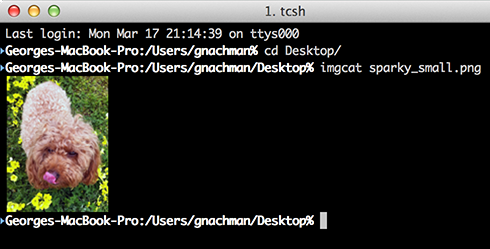
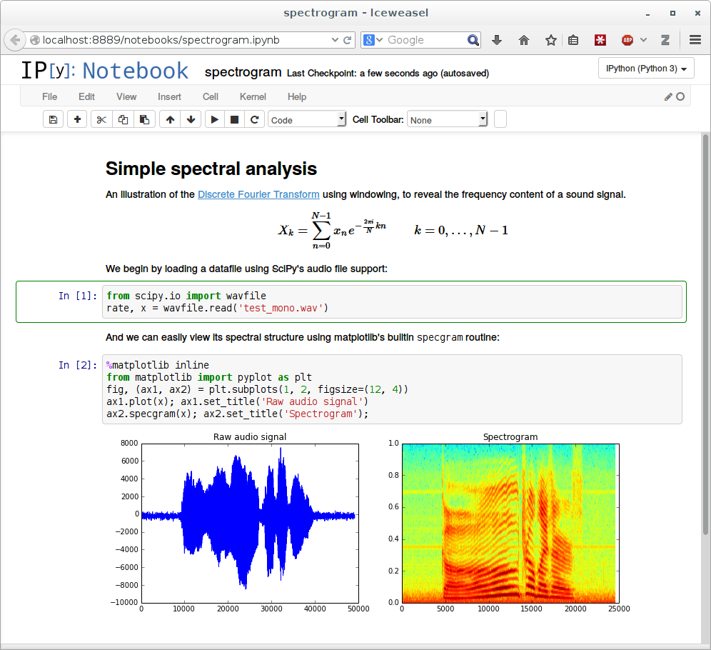
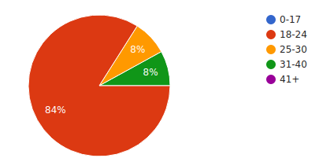
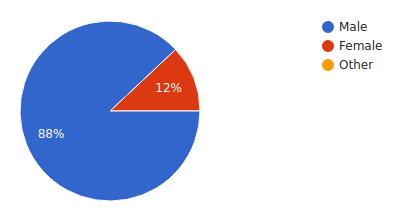
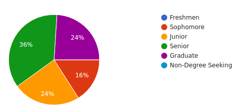
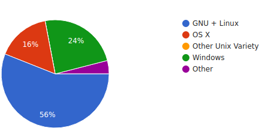
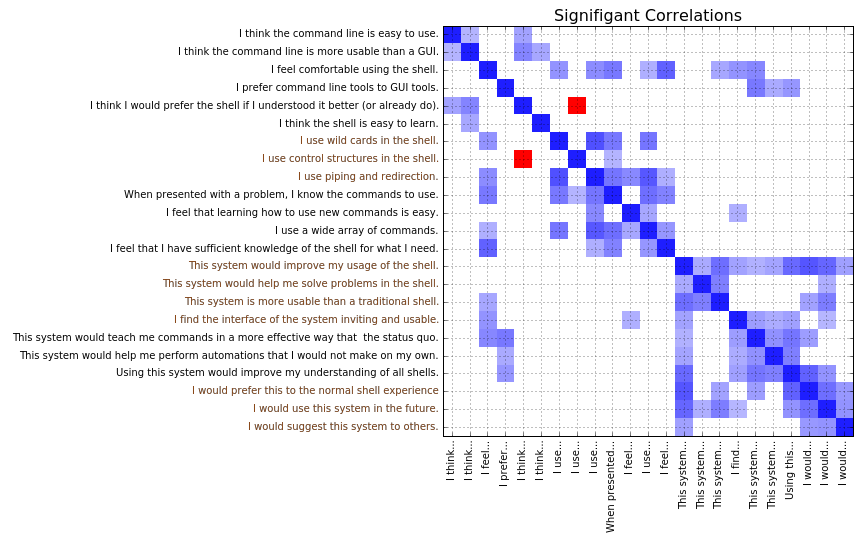
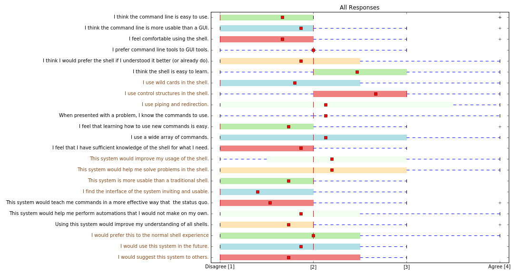

Background
=================

* Programmers and data scientists use the terminal
* We all love the efficiency and expressive power
* But the interface was designed in 1960 for a PDP-11
* Why should you have to memorize 100 three letter words?
* Can't we do better?

Problem Solved!
=================

* Terminal Fever is a radically modern approach to the command line
* It knows the commands you use, and helps you discover the ones you don't
* Provide heads up information so you're never unsure of what's going on
* Allows any destructive command to be undone - so you can feel safe
* *It automates automation!* - bash one-liners are at your fingertips!

Target Audience
=================
* Beginners who want to learn to use the command line
* Wizards who want to tab complete an entire rails app
* Everyone in between!

Beginners
===============

* No experience with UNIX operating systems
* No experience with a CLI
* No experience with the state inherent to a shell, mainly the current
  working directory
* No knowledge of what programming is, or how to automate tasks
* No knowledge of the anatomy of a command (command name, arguments,
  options, et cetera)
* No knowledge of the software available on their system
* No knowledge of basic OS tasks, such as installing software
* Has experience with common GUI techniques - click-to-open,
  drag-and-drop, et cetera

Casual Users
===============

* Understand the basics of how computers work
* Understand what computer programs are or has knowledge of how to
  program
* Only familiar with a GUI, or are more comfortable with pointing
  and clicking than typing
* Regularly needs to perform some repetitive task on their computer,
  but does not imagine the task could be automated
* Finds themselves lost if/when they use the CLI - doesn’t understand
  the larger context of the system surrounding the shell
* Is unaware of most of the programs, commands, and command line
  options they could be using (has only seen the tip of the iceberg)
* Does not know how to apply technical knowledge or programming skills
  to system tasks in the CLI

Advanced User
===============

* Deep understanding of OS structure and interfaces
* Mastery of command line usage
* Commonly constructs aliases and automates tasks
* Consults system documentation to find advanced command options
* Understands that task inference is frequently achievable from
  context in the shell

`#GOALS`
==================
* As any user, I want to be able to undo what I’ve done.
* As a beginner, I want to know what I can do with a file.
* As a casual user, I want to automate my workflow.
* As a beginner, I want to know what the command is going to do.
* As an expert user, I want heads-up information about my system as I
  use it.

Hasn't this been done before?
==================

God no
===

Still not really...
===

Not far enough!
====

I NEED MORE POWER
===

Features
=================

Autocomplete
=================

Undo Window
============

Automation Helper
============

Prototype
============

](figures/prototype/cmd.jpg)

Testing (one, two)
=====

* Survey test users on prototype
* Collect demographic data:
    * Age
    * Gender
    * Education
    * Major
    * Primary OS
* Guage familiarity, knowledge, and efficiency

Did you like it?
====

* Yes or yes?
* Was it useful?
* Was the interface usable?
* Could you learn from it?

Results
=====

 ------------------------------------- -------------------------------------
           

     
 ------------------------------------- -------------------------------------
<!-- : 2x2 images in table -->

`#DATASCIENCE`
==========

 * * *

Conclusion
============

* People found the prototype confusing (30% dropped before taking the exit survey)
* *Even more* information needs to be given to the users
* Experienced users felt they didn't need a teaching tool
* More research, with an improved prototype, can tell us even more

Questions?
============
